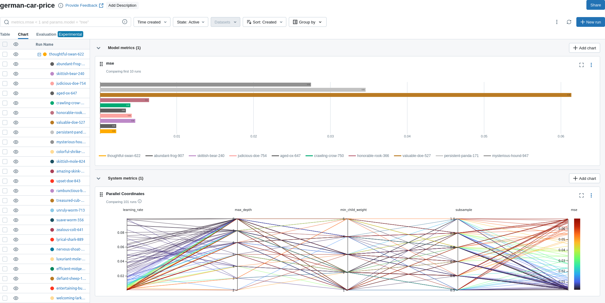

# Tracking Machine Learning Experiments with MLflow and Dockerizing the Best Model

This project focuses on predicting the prices of Germany cars using the XGBoost algorithm. The dataset utilized for this experiment is the [Germany Cars Dataset](https://www.kaggle.com/datasets/ander289386/cars-germany), which has been preprocessed and cleaned for this machine learning task. XGBoost is employed to train a model on the dataset. Given its various parameters, I utilize [Hyperopt](http://hyperopt.github.io/hyperopt/) to search for the optimal settings. However, the code can easily accommodate other hyperparameter optimization libraries such as [Optuna](https://optuna.org/). To track experiments and record parameters, metrics, and models, MLflow is utilized.

### Install Dependencies
Ensure you have installed the necessary libraries by running:
```
pip install -r requirements.txt
```

## MLflow Server
An MLflow tracking server is essential for monitoring experiments and logging parameters and metrics. By default, the code assumes the URI of the MLflow server to be `http://localhost:8080`. If you are using a different server or port, you can modify the URI in the code.

## Running the Experiment Using XGBoost
To execute the experiment, run the following command:
```
python run_experiment.py
```

The code optimizes four parameters for XGBoost:
1. `max_depth`
2. `subsample`
3. `learning_rate`
4. `min_child_weight`

For a better understanding of these parameters, refer to the [XGBoost documentation](https://xgboost.readthedocs.io).

### Results
Upon completion of the run, the code prints the following results:
```
Parameters of the best model: {'learning_rate': 0.09995079867030887, 'max_depth': 8.0, 'min_child_weight': 1.0, 'subsample': 0.8}
Mean squared error (MSE) of the best model on the validation dataset: 0.0034018279674554825
```

Since the validation dataset is used for hyperparameter optimization, the best model is evaluated using the test set:
```
Mean squared error (MSE) of the best model on the test dataset: 0.0032792110596197833
```

If you have not changed the parameter `experiment_name`, you can view the experiment named `german-car-price` in the MLflow UI:


Additionally, the best model, saved under the name `german-car-price-best-model`, can be found in the registered models tab.

## Serve the Model
The registered model can be served using:
```
mlflow models serve -m "models:/german-car-price-best-model/1" --port 5002
```

You may need to first run:
```
export MLFLOW_TRACKING_URI=http://localhost:8080
```

To test the model, requests can be sent to the REST API using the curl command:
```
curl -d '{"dataframe_split": { "columns": ["make", "model", "fuel", "gear", "offerType", "mileage_log", "hp", "age"], "data": [["BMW", "118",   "Diesel", "Manual", "Used", 5.019116, 143.0, 10]]}}' -H 'Content-Type: application/json' -X POST localhost:5002/invocations
```

which returns the following result:
```
{"predictions": [3.950029134750366]}
```

As the model is trained to predict the logarithm of price, the output is in logarithmic scale and should be converted back using `10**prediction`.

## Build a Docker Image for the Model
To create a docker image for the registered model, use:
```
mlflow models build-docker --model-uri "models:/german-car-price-best-model/1" --name "german-car-price"
```

The docker image created, named `german-car-price`, can later be run locally, on a server, or on a cloud.

<!---
For a more detailed explanation of the code, refer to the accompanying Jupyter notebook file.
--->

