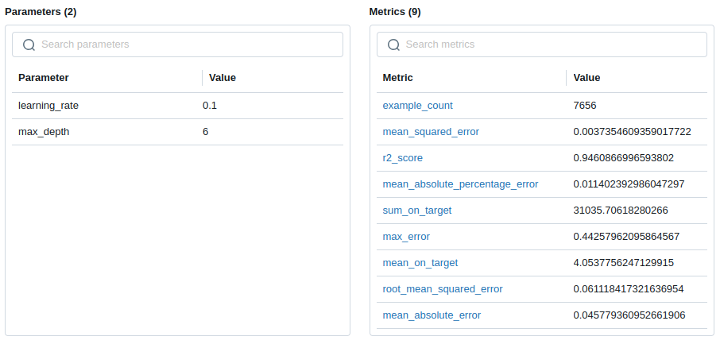

# Logging Datasets in Machine Learning Experiments with MLflow

MLflow is widely recognized as a powerful tool for tracking machine learning (ML) experiments, enabling data scientists and ML experts to systematically log metrics, parameters, and models. However, its capabilities extend beyond these traditional use cases—MLflow can also be used to **track datasets**. Logging information about training and evaluation datasets is a critical step in enhancing the transparency and reproducibility of ML experiments. By capturing dataset details, such as versioning and splits, MLflow helps ensure that experiments can be accurately replicated and understood.

In this post, I demonstrate how to use MLflow to track datasets alongside parameters, metrics, and other experiment artifacts. As an example, I use the [Germany Cars Dataset](https://www.kaggle.com/datasets/ander289386/cars-germany), a publicly available dataset on Kaggle, to build a model for predicting the prices of German cars.

If you're interested in learning more about this dataset and how to clean and prepare it for modeling, you can check out my other [post](https://medium.com/@mohsenim/tracking-machine-learning-experiments-with-mlflow-and-dockerizing-trained-models-germany-car-price-e539303b6f97).

## How to Track Datasets with MLflow

MLflow provides several ways to log datasets, including:
- **Logging dataset artifacts**: Save the dataset file itself (e.g., CSV, Parquet) as an artifact.
- **Logging dataset splits and metadata**: Record information such as dataset name, source, and the dataset splits, i.e., training, validation, and test sets. This is the focus of this post.

MLflow natively supports the following dataset types:

- `mlflow.data.pandas_dataset.PandasDataset`
- `mlflow.data.numpy_dataset.NumpyDataset`
- `mlflow.data.spark_dataset.SparkDataset`
- `mlflow.data.huggingface_dataset.HuggingFaceDataset`
- `mlflow.data.tensorflow_dataset.TensorFlowDataset` 

## Traning a Car Price Perdiction Model 
Let’s start by importing the necessary libraries for reading the dataset, training models, and tracking models and results.


```python
import mlflow
import numpy as np
import pandas as pd
import xgboost as xgb
from mlflow.models import infer_signature
from sklearn import preprocessing
from sklearn.compose import ColumnTransformer
from sklearn.metrics import mean_squared_error
from sklearn.model_selection import train_test_split
from sklearn.pipeline import Pipeline
```

## MLflow Server
An MLflow tracking server is used to monitor our experiment and log parameters and metrics. We assumes the URI of the MLflow server to be `http://localhost:8080`. If you are using a different server or port, you can modify the URI.


```python
mlflow.set_tracking_uri(uri="http://127.0.0.1:8080")
```

## ML Model

We define a function that creates a pipeline for preprocessing categorical variables and incorporates an [XGBoost](https://xgboost.readthedocs.io) model as our machine learning model.


```python
def get_xgb_model_pipeline(categorical_cols, max_depth, learning_rate):
    """
    Build the pipline
    """
    ordinal_encoder = preprocessing.OrdinalEncoder()
    preprocess = ColumnTransformer(
        [("Ordinal-Encoder", ordinal_encoder, categorical_cols)],
        remainder="passthrough",
    )
    xgb_model = xgb.XGBRegressor(max_depth=max_depth, learning_rate=learning_rate)
    pipeline = Pipeline([("preprocess", preprocess), ("xgb_model", xgb_model)])
    return pipeline

```

## Loading the Dataset

The following code reads the dataset into a pandas dataframe, which includes both categorical and numerical columns. We need to specify the categorical columns as the pipeline defined above should be aware of them to transform them before passing them to the model.


```python
dataset_path = "./data/autoscout24-germany-dataset-cleaned.csv"
df = pd.read_csv(dataset_path)
categorical_cols = ["make", "model", "fuel", "gear", "offerType"]
numerical_cols = ["mileage_log", "hp", "age", "price_log"]

cols = categorical_cols + numerical_cols
data = df[cols]

df_train, df_test = train_test_split(data, test_size=0.20, random_state=37)
train_x = df_train.drop(["price_log"], axis=1)
train_y = df_train[["price_log"]]

test_x = df_test.drop(["price_log"], axis=1)
test_y = df_test[["price_log"]]

```

## Train Model and Log Artifacts

In the following code, we first set a name for our experiment that MLflow will use to group all artifacts related to this experiment in one place. 
In the function `train`, we define an MLflow dataset and set metadata such as `source`, `name`, and the target column, `price_log`. If you'd like to save the splits as well, you can do that. In the code for the train dataset, an MLflow dataset is also created.

After setting the experiment and starting a run, we can save the datasets using `mlflow.log_input`. It is also possible to define a `context` for adding more information and showing where a dataset has been used. 
The code also logs two parameters of the model and the evaluation metric, which is the **mean squared error (MSE)**.


```python
experiment_name="german-car-price"
artifact_path="german_car_model"

max_depth=6
learning_rate=0.1
model = get_xgb_model_pipeline(categorical_cols, max_depth, learning_rate)


def train():
    """
    Train the model
    """
    dataset = mlflow.data.from_pandas(df,
                                      source="./data/autoscout24-germany-dataset.csv", 
                                      name="Germany Car Dataset - Cleaned", 
                                      targets="price_log"
                                      )

    dataset_train = mlflow.data.from_pandas(df_train, 
                                            name="Training dataset", 
                                            targets="price_log"
                                            )


    mlflow.set_experiment(experiment_name=experiment_name)

    with mlflow.start_run():
        mlflow.log_input(dataset=dataset)
        mlflow.log_input(dataset=dataset_train, context="training")

        model.fit(train_x, train_y)

        # Evaluation
        pred_y = model.predict(test_x)
        eval_metric = mean_squared_error(test_y, pred_y)

        # Log the parameters, metric and model
        mlflow.log_param("max_depth", max_depth)
        mlflow.log_param("learning_rate", learning_rate)

        mlflow.log_metric("MSE", eval_metric)

        signature = infer_signature(train_x[:1], train_y[:1])
        mlflow.sklearn.log_model(
            model, 
            artifact_path=artifact_path, 
            signature=signature
        )

    return eval_metric

```

Let’s run the code and see the results, which show 0.00374 as the MSE of the model.


```python
result = train()
print(f"Trained! Mean squared error (MSE) of the model: {result}")
```

    Trained! Mean squared error (MSE) of the model: 0.0037354609359017722


## A Cool Feature of MLFlow

Before showing the results in the MLflow UI, I want to highlight a cool feature of MLflow. Instead of manually evaluating a model and logging a single metric, you can use `mlflow.evaluate` to perform the evaluation using several metrics based on the type of your ML task. If you allow MLflow to handle this, it will also automatically log the evaluation dataset. I’ve updated the code as follows:


```python
model = get_xgb_model_pipeline(categorical_cols, max_depth, learning_rate)

def train():
    """
    Train the model
    """
    dataset = mlflow.data.from_pandas(df,
                                      source="./data/autoscout24-germany-dataset.csv", 
                                      name="Germany Car Dataset - Cleaned", 
                                      targets="price_log"
                                      )

    dataset_train = mlflow.data.from_pandas(df_train, 
                                            name="Training dataset", 
                                            targets="price_log"
                                            )


    mlflow.set_experiment(experiment_name=experiment_name)

    with mlflow.start_run():
        mlflow.log_input(dataset=dataset)
        mlflow.log_input(dataset=dataset_train, context="training")

        model.fit(train_x, train_y)

        # Evaluation
        pred_y = model.predict(test_x)
        eval_metric = mean_squared_error(test_y, pred_y)

        # Log the parameters, metric and model
        mlflow.log_param("max_depth", max_depth)
        mlflow.log_param("learning_rate", learning_rate)

        signature = infer_signature(train_x[:1], train_y[:1])
        mlflow.sklearn.log_model(
            model, 
            artifact_path=artifact_path, 
            signature=signature
        )

        df_test['prediction'] = pred_y
        dataset_test = mlflow.data.from_pandas(df_test,
                                            name="Test dataset",
                                            predictions="prediction", 
                                            targets="price_log"
                                            )
        result = mlflow.evaluate(data=dataset_test, predictions=None, model_type="regressor")
    return result

result = train()

metrics = pd.DataFrame.from_dict(result.metrics, orient='index', columns=['value'])
display(metrics)
```


<div>
<style scoped>
    .dataframe tbody tr th:only-of-type {
        vertical-align: middle;
    }

    .dataframe tbody tr th {
        vertical-align: top;
    }

    .dataframe thead th {
        text-align: right;
    }
</style>
<table border="1" class="dataframe">
  <thead>
    <tr style="text-align: right;">
      <th></th>
      <th>value</th>
    </tr>
  </thead>
  <tbody>
    <tr>
      <th>example_count</th>
      <td>7656.000000</td>
    </tr>
    <tr>
      <th>mean_absolute_error</th>
      <td>0.045779</td>
    </tr>
    <tr>
      <th>mean_squared_error</th>
      <td>0.003735</td>
    </tr>
    <tr>
      <th>root_mean_squared_error</th>
      <td>0.061118</td>
    </tr>
    <tr>
      <th>sum_on_target</th>
      <td>31035.706183</td>
    </tr>
    <tr>
      <th>mean_on_target</th>
      <td>4.053776</td>
    </tr>
    <tr>
      <th>r2_score</th>
      <td>0.946087</td>
    </tr>
    <tr>
      <th>max_error</th>
      <td>0.442580</td>
    </tr>
    <tr>
      <th>mean_absolute_percentage_error</th>
      <td>0.011402</td>
    </tr>
  </tbody>
</table>
</div>


As we can see, based on our task (regression), MLflow automatically calculated several relevant metrics for us.

## Looking at Results in the MLflow UI

Let’s take a look at the UI. In the following image, we can see that MLflow has logged three datasets for our experiment.


The list of metrics can also be seen in the UI.



👍 Thumbs up or 👏 clap if you liked this post!
